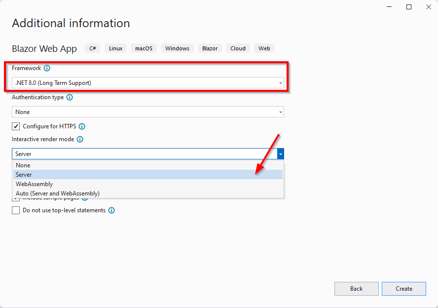

# Blazor State Management

## Documentatie
https://learn.microsoft.com/en-us/aspnet/core/blazor/state-management?view=aspnetcore-8.0&pivots=server

## Setup
In dit voorbeeld gebruiken we de Blazor template voor .NET8:
- Maak een nieuwe *Blazor Web App* project

- Project name: **BlazorStateManagement**

- Selecteer *.NET8.0* als framework en *Server* als render mode

## Probleem
Wanneer we de applicatie starten en naar de Counter-page navigeren kunnen we de counter variabele telkens met één verhogen.
De waarde van de variabele wordt echter gereset wanneer we de pagina opnieuw laden. De oorzaak hiervan is dat de *state* van de applicatie niet bewaard wordt.

## Oplossing
Een mogelijke oplossing is om alle data te bewaren in een (al dan niet relationele) database zoals SQL Server. Dit is helaas niet altijd mogelijk maar net zoals in dit geval vooral vaak overkill.
In dit geval is het dus beter de waarde van deze variabele te bewaren in de *localStorage* van de browser. De localStorage kan worden benaderd door gebruik te maken van [JavaScript interoperability](https://learn.microsoft.com/en-us/aspnet/core/blazor/javascript-interoperability/?view=aspnetcore-8.0), hiermee kan JavaScript worden aangeroepen vanuit Blazor C#.
Omdat deze functionaliteit vaak nodig is, is er een NuGet package beschikbaar die dit voor ons afhandelt: [Blazored.LocalStorage](https://github.com/Blazored/LocalStorage)

## Oefening
1. Installeer de Blazored.LocalStorage package			
		
De [Blazored](https://github.com/Blazored/) collectie bevat nog enkele andere leuke packages die je kan gebruiken in je Blazor projecten!
2. Registreer de service in de *Program.cs* file

        builder.Services.AddBlazoredLocalStorage();

3. Injecteer de *ILocalStorageService* in het *Counter.razor* component
4. Haal de waarde van de counter variabele op uit de *localStorage* in de *OnAfterRenderAsync* lifecycle method
5. Bewaar de waarde van de counter variabele in de *localStorage* in de *IncrementCount* method

        @inject Blazored.LocalStorage.ILocalStorageService localStorage
        @page "/counter"
        @rendermode InteractiveServer

        <PageTitle>Counter</PageTitle>

        @if(currentCount.HasValue)
        {
            <h1>Counter</h1>

            
Current count: @currentCount

            <button class="btn btn-primary" @onclick="IncrementCount">Click me</button>
        }
        else
        {
            
<em>Loading...</em>

        }
        @code {
            private int? currentCount;

            protected override async Task OnAfterRenderAsync(bool firstRender)
            {
                await Task.Delay(1000); // Only to simulate a delay

                // Get value for currentCount from local storage
                currentCount = await localStorage.GetItemAsync<int>("counter");

                // Notify Blazor that the state has changed
                StateHasChanged();
            }

            private async Task IncrementCount()
            {
                currentCount++;

                // Store the new value of currentCount in local storage
                await localStorage.SetItemAsync("counter", currentCount);
            }
        }